# Visual Guide — *From Copilot to Colleague*

A complete visual companion to the book **From Copilot to Colleague: How AI Engineering Turns Models into Dependable Systems**.

Fourteen diagrams: **four** that map the book and the project that produces it, and **ten** that open each chapter with a concrete *before → after*.

Every diagram is a hand-built [Excalidraw](https://excalidraw.com) file (`.excalidraw`, fully editable) rendered to PNG. They are designed to **argue visually** — each shape mirrors the concept it represents, not just label a box.

> The governing thesis: *Models create possibility. Scaffolding creates trust. Organizations decide whether that trust compounds.*

---

## Part I — The Book at a Glance

Four diagrams for the whole project: its argument, how it is made, its core thesis, and its evidence base.

### 1 · The Argument Spine

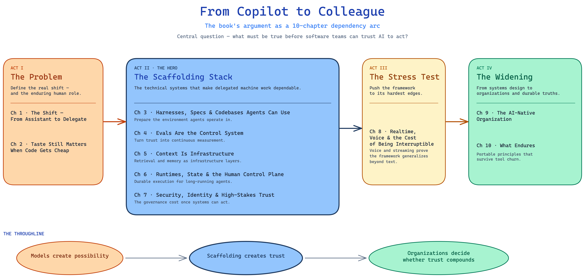

The ten chapters as a **four-act dependency arc** — the Problem (ch 1–2), the Scaffolding Stack (ch 3–7), the Stress Test (ch 8), and the Widening (ch 9–10). It shows the book is an argument with a shape, not a survey, and carries the throughline from possibility to compounding trust.

### 2 · The Autoresearch Knowledge Machine

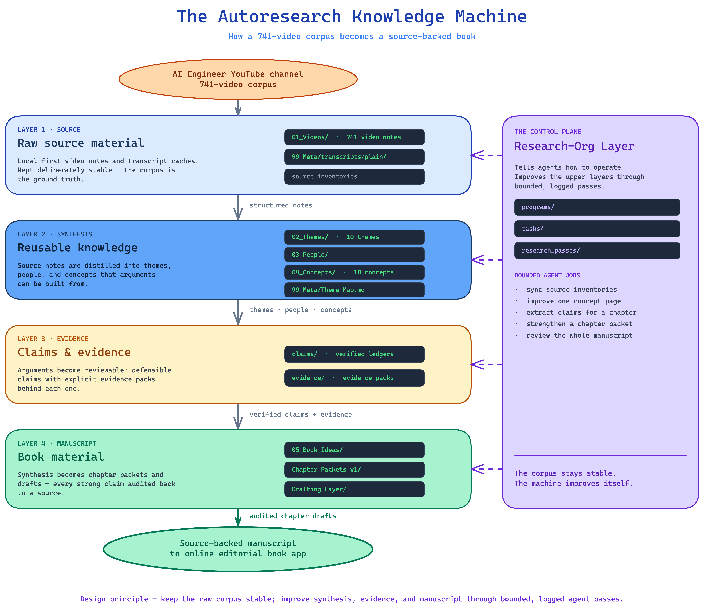

How a 741-video corpus becomes a source-backed book: a five-layer pipeline — **Source → Synthesis → Evidence → Manuscript** — governed by a Research-Org control plane that improves the upper layers through bounded, logged agent passes. Real directory names are shown as evidence.

### 3 · The Scaffolding Stack

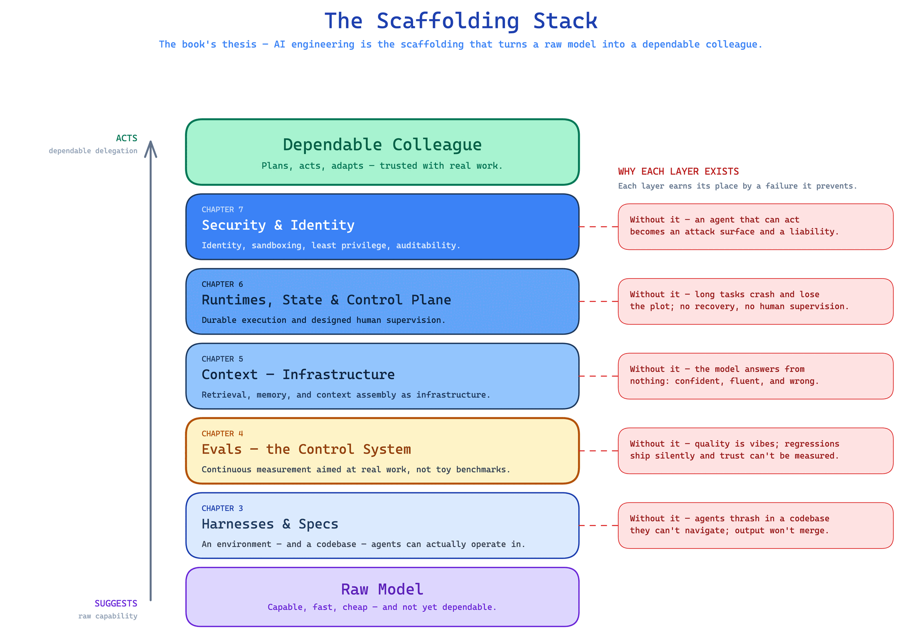

The book's central thesis in one picture: a raw model is capable but not dependable. Five engineered layers wrap it — harnesses, evals, context, runtimes, security — and each one earns its place by a specific failure it prevents.

### 4 · Theme & Corpus Map

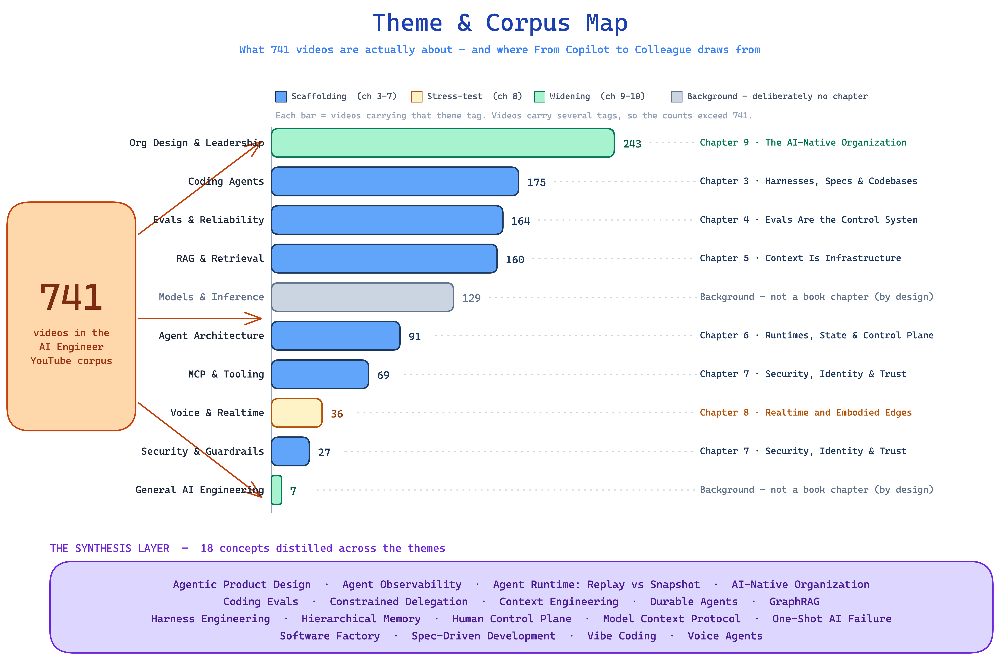

What 741 videos are actually about: ten themes sized by corpus count, colour-coded by the book act they feed, each mapped to its chapter — including the honest editorial call that *Models & Inference* is deliberately background, not a chapter.

---

## Part II — Chapter by Chapter

Each chapter diagram contrasts **the naive way** — how AI work goes wrong today — with **the engineered way** — the best practice the chapter argues for. Both sides carry a concrete code or config sample, and the chapter's four strongest claims sit underneath.

### Chapter 1 · The Shift: From Assistant to Delegate

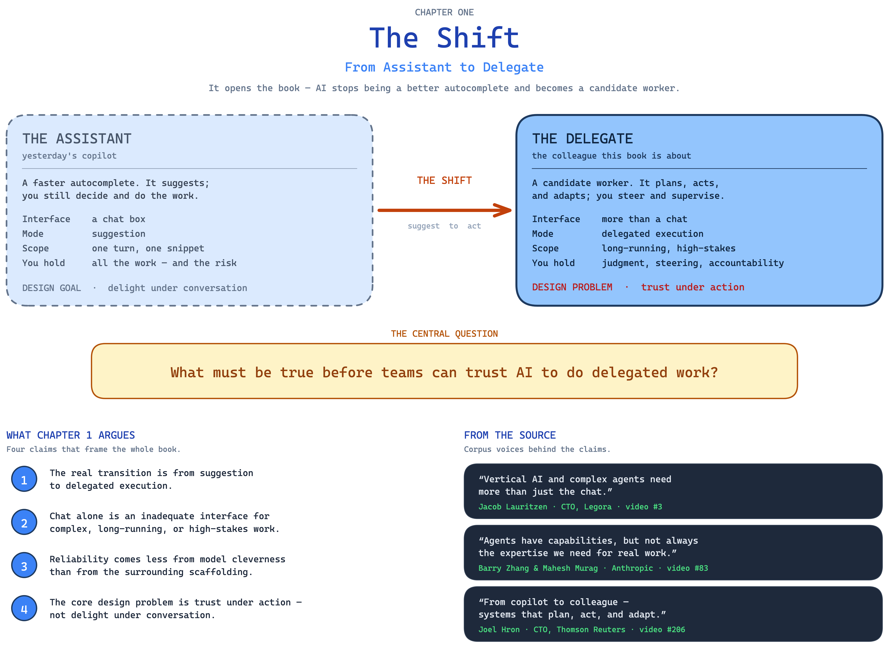

The book's opening move: AI stops being a better autocomplete and becomes a candidate worker. Assistant vs delegate, side by side — and the central question the whole book answers: *what must be true before teams can trust AI to act?*

### Chapter 2 · Taste Still Matters When Code Gets Cheap

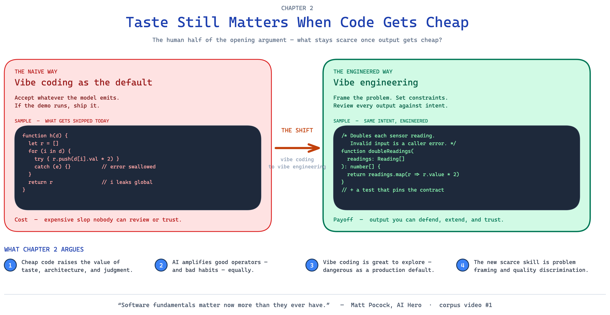

When generation gets cheap, judgment gets scarce. *Vibe coding* (ship whatever runs) vs *vibe engineering* (frame, constrain, review) — shown with the same intent written two ways.

### Chapter 3 · Harnesses, Specs & Codebases Agents Can Use

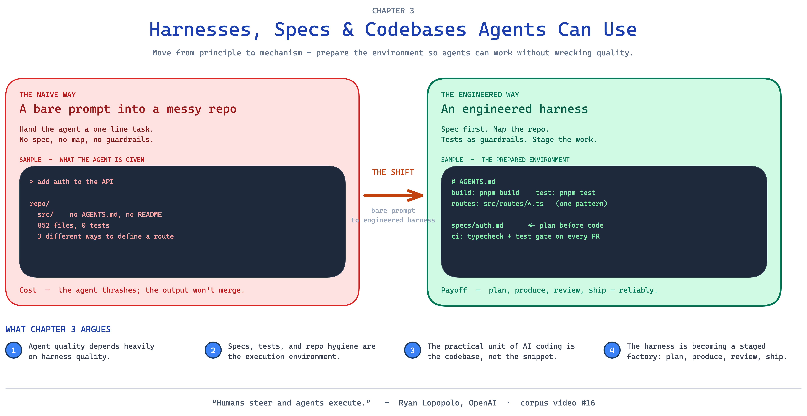

Agent quality depends on harness quality. A bare prompt into a messy repo vs a prepared environment — `AGENTS.md`, specs, tests as guardrails, a staged plan → produce → review → ship loop.

### Chapter 4 · Evals Are the Control System

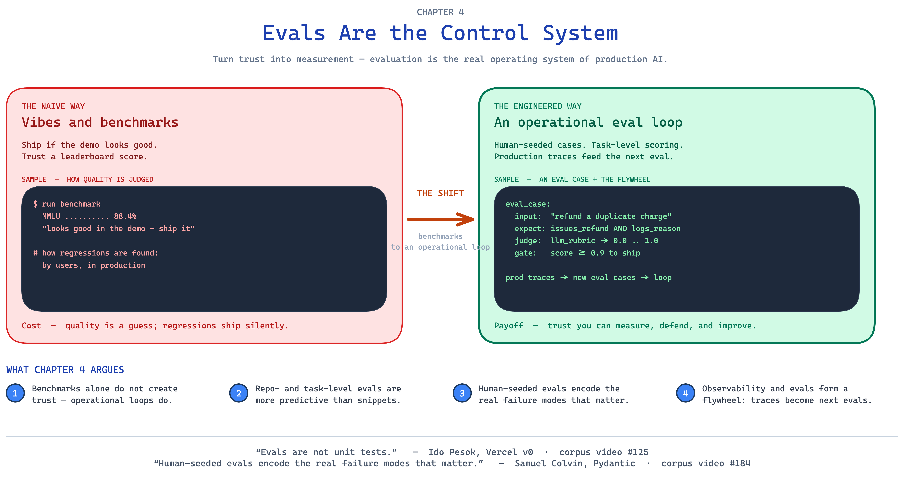

Trust has to be measured. Demo vibes and a leaderboard score vs an operational eval loop — human-seeded cases, task-level scoring, and production traces that feed the next generation of evals.

### Chapter 5 · Context Is Infrastructure

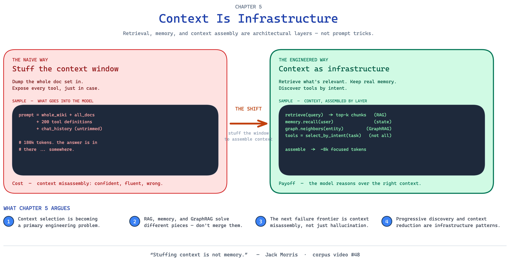

Prompt quality is downstream of information architecture. Stuffing 180k tokens into the window vs assembling context by layer — RAG, memory, GraphRAG, intent-aware tool selection.

### Chapter 6 · Runtimes, State & the Human Control Plane

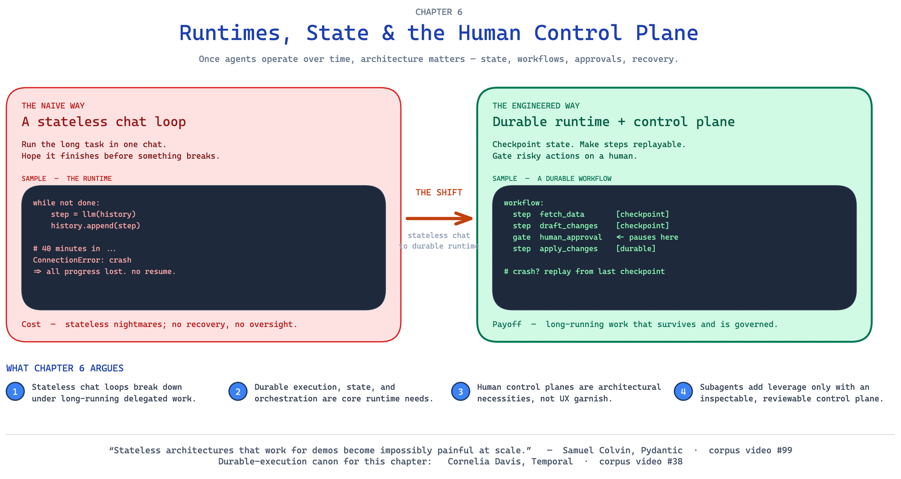

Long-running work needs architecture. A stateless chat loop that loses everything on a crash vs a durable runtime with checkpoints, replay, and a human approval gate.

### Chapter 7 · Security, Identity & High-Stakes Trust

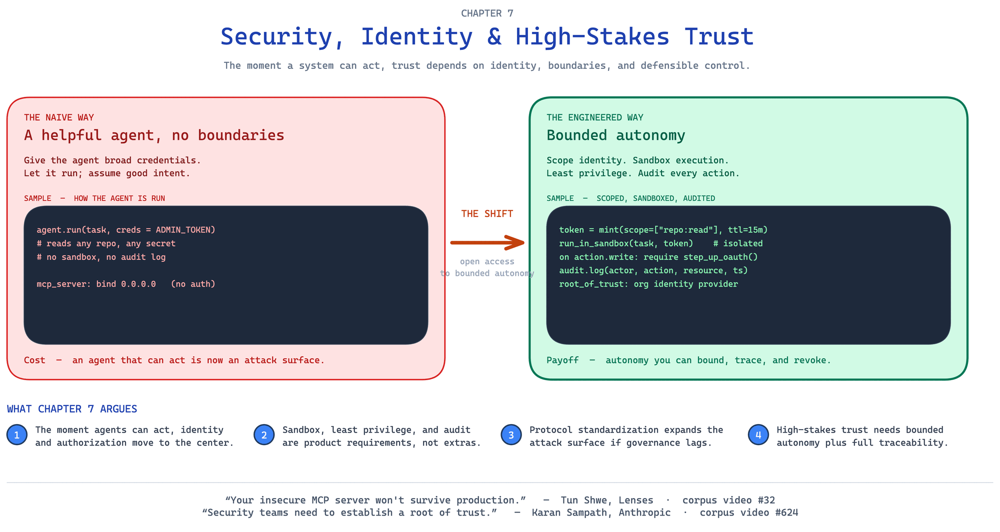

The moment a system can act, it becomes an attack surface. A helpful agent with admin credentials vs bounded autonomy — scoped identity, sandboxing, least privilege, an audit trail, a root of trust.

### Chapter 8 · Realtime and Embodied Edges

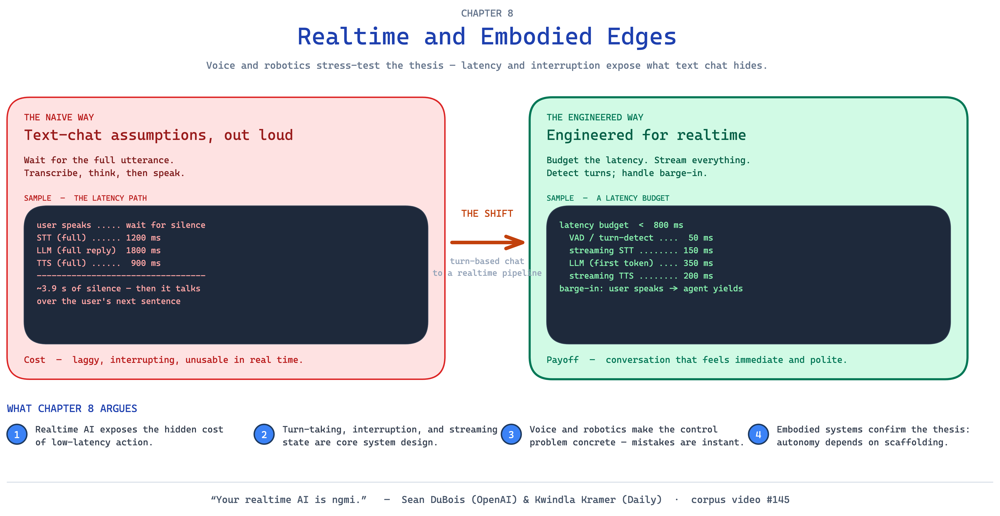

Voice and robotics stress-test the thesis. Text-chat assumptions out loud (≈3.9 s of lag) vs a realtime pipeline with a sub-800 ms latency budget, streaming, turn detection, and barge-in.

### Chapter 9 · The AI-Native Organization

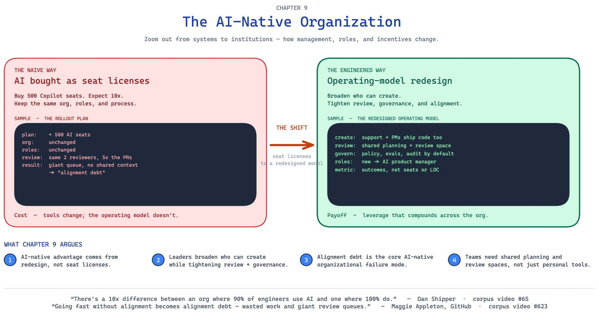

The deepest gains are organizational. Buying 500 AI seats and changing nothing else vs an operating-model redesign — broaden who can create, tighten review and governance, pay down *alignment debt*.

### Chapter 10 · What Endures

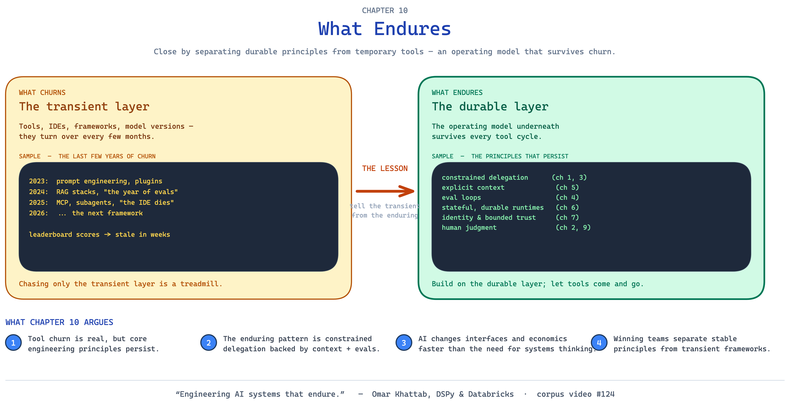

The close: separate the tools that churn every few months from the operating model that survives them — constrained delegation, explicit context, eval loops, durable runtimes, bounded trust, and human judgment.

---

## How these were made

- **Built with** the `excalidraw-diagram` skill — diagrams that argue visually, hand-authored as Excalidraw JSON and validated through a render-and-review loop.
- **Sourced from** the book knowledge base: chapter packets, the source-backed outline, the theme map, and the project architecture docs.
- **To edit:** open any `.excalidraw` file at [excalidraw.com](https://excalidraw.com) (or in the Excalidraw VS Code / Obsidian plugin).
- **To re-render to PNG:**
  ```bash
  cd ~/.claude/skills/excalidraw-diagram/references
  uv run python render_excalidraw.py <path-to-file.excalidraw>
  ```

## Style & templates

The book's diagram identity is documented in **[`STYLE.md`](STYLE.md)** — palette mapping, the blue→green signature mark, title system, citation style, and defensibility rules.

Reusable skeletons live in **[`templates/`](templates/)** — copy one, fill the `[bracketed]` placeholders, render:

- `inline-figure.excalidraw` — a small single-idea section figure
- `concept-card.excalidraw` — a standalone concept explainer
- `chapter-card.excalidraw` — a full-page before → after chapter diagram
- `layered-stack.excalidraw` — "X is built of layers"
- `flow-pipeline.excalidraw` — a process or pipeline
- `relationship-map.excalidraw` — nodes and edges (graphs, maps)

## Files

| # | Diagram | Source | Render |
|---|---------|--------|--------|
| 1 | The Argument Spine | `01-book-argument-spine.excalidraw` | `01-book-argument-spine.png` |
| 2 | The Autoresearch Knowledge Machine | `02-autoresearch-machine.excalidraw` | `02-autoresearch-machine.png` |
| 3 | The Scaffolding Stack | `03-scaffolding-stack.excalidraw` | `03-scaffolding-stack.png` |
| 4 | Theme & Corpus Map | `04-theme-corpus-map.excalidraw` | `04-theme-corpus-map.png` |
| 5 | Chapter 1 — The Shift | `05-chapter1-the-shift.excalidraw` | `05-chapter1-the-shift.png` |
| 6 | Chapter 2 — Taste | `06-chapter2-taste.excalidraw` | `06-chapter2-taste.png` |
| 7 | Chapter 3 — Harnesses | `07-chapter3-harnesses.excalidraw` | `07-chapter3-harnesses.png` |
| 8 | Chapter 4 — Evals | `08-chapter4-evals.excalidraw` | `08-chapter4-evals.png` |
| 9 | Chapter 5 — Context | `09-chapter5-context.excalidraw` | `09-chapter5-context.png` |
| 10 | Chapter 6 — Runtimes | `10-chapter6-runtimes.excalidraw` | `10-chapter6-runtimes.png` |
| 11 | Chapter 7 — Security | `11-chapter7-security.excalidraw` | `11-chapter7-security.png` |
| 12 | Chapter 8 — Realtime | `12-chapter8-realtime.excalidraw` | `12-chapter8-realtime.png` |
| 13 | Chapter 9 — AI-Native Org | `13-chapter9-ai-native-org.excalidraw` | `13-chapter9-ai-native-org.png` |
| 14 | Chapter 10 — What Endures | `14-chapter10-what-endures.excalidraw` | `14-chapter10-what-endures.png` |
